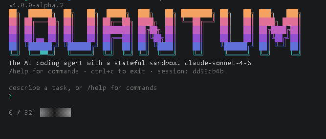
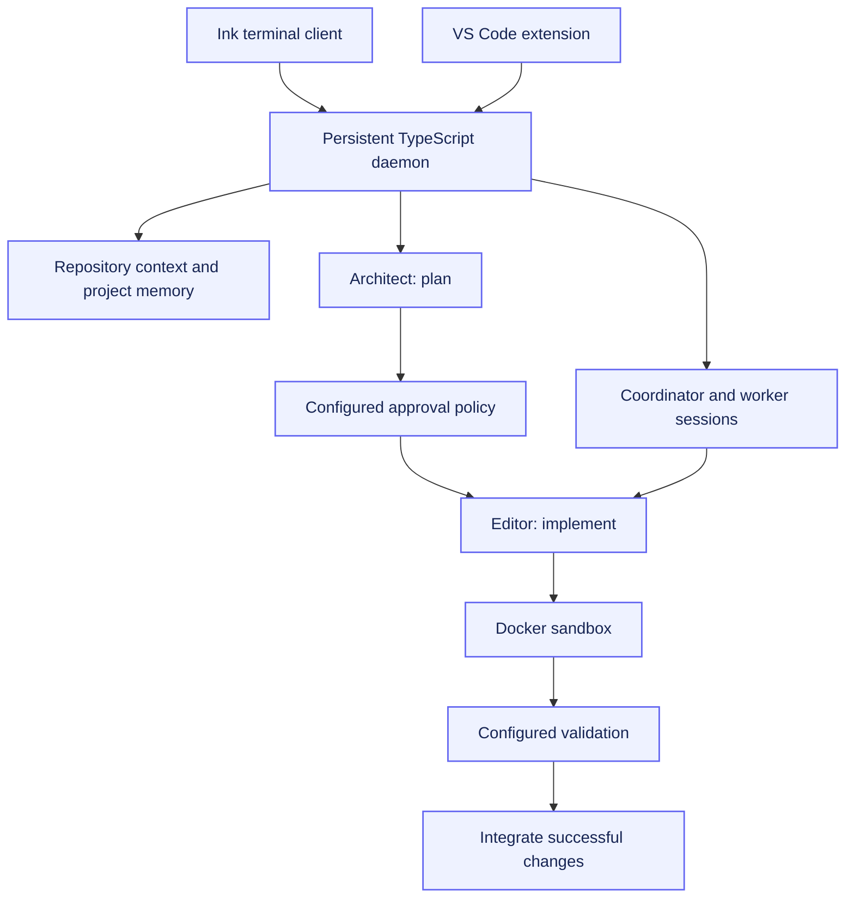

<div align="center">

# iquantum

**An inspectable AI coding workflow: plan, implement, validate.**

TypeScript · Bun · Terminal UI · VS Code · Docker

[Quick start](#quick-start) · [Architecture](#architecture) · [Usage guide](USAGE.md) · [Configuration](CONFIGURATION.md)

[](https://github.com/AyhamJo7/iquantum/actions/workflows/ci.yml)
[](LICENSE)



</div>

## Overview

iquantum is an AI coding agent with a persistent daemon, an interactive terminal client,
and a VS Code extension. Its Plan → Implement → Validate (PIV) workflow separates
planning from editing, exposes the proposed changes, and runs configured checks before
integrating a successful task into the target repository.

The source CLI version is **4.0.0-alpha.2**. Treat this checkout as alpha software;
package registry versions can differ from the checked-out source.

## What it brings together

| Capability | Engineering approach |
| --- | --- |
| Explicit planning | Separate Architect and Editor model roles, with configurable plan approval |
| Isolated PIV execution | Docker sandbox lifecycle and optional Git worktree sessions |
| Multi-agent coordination | Worker manifests, dependency ordering, parallel workers and integrated validation |
| Repository context | AST-based repository mapping, project memory, context budgeting and compaction |
| Inspectable changes | Diffs, Git checkpoints, file snapshots and code review commands |
| Extensible workflows | MCP tools, hooks, skills and Anthropic or OpenAI-compatible providers |
| Multiple clients | Ink terminal UI and VS Code client connected to the same daemon |

## Quick start

Requirements: **Bun 1.3+**, npm, Git, a reachable Docker daemon for local sandbox
execution, and credentials for your selected model provider. On Windows, use WSL2
with Docker Desktop's WSL integration enabled.

```bash
npm install -g @iquantum/cli
bun --version
iq --version

cd /path/to/your/git-repository
iq init
iq
```

The setup wizard configures provider access. In the interactive session, describe a
small task, inspect the plan, and approve or revise it. Start with a disposable
repository and review the resulting diff before using it on important work.

For this exact source checkout:

```bash
git clone https://github.com/AyhamJo7/iquantum.git
cd iquantum
bun install
bun run build
bun run build:dist
```

See the [usage guide](USAGE.md) for terminal commands, daemon management, review,
worktrees and coordinator mode; see the [configuration reference](CONFIGURATION.md)
for provider credentials, model selection and execution policies.

## Architecture



The daemon owns session state, model calls and execution. Clients render events and
collect user decisions. Shared packages keep configuration, provider routing,
repository context, execution and UI state separate.

| Location | Responsibility |
| --- | --- |
| `iquantum-cli/` | `iq` commands and interactive Ink interface |
| `iquantum-daemon/` | Sessions, conversations, persistence and task orchestration |
| `iquantum-vscode/` | Editor integration |
| `packages/piv-engine/`, `packages/coordinator/` | Task state machine and worker coordination |
| `packages/sandbox/`, `packages/git/`, `packages/diff-engine/` | Execution environments, checkpoints and changes |
| `packages/repo-map/`, `packages/memory/`, `packages/context-window/` | Repository context and budgets |
| `packages/permissions/`, `packages/approval/` | Tool permissions and plan approval policies |

## Execution boundaries

PIV sandbox validation is a specific workflow, not a universal guarantee for every
mode or tool. Chat, file tools, hooks, MCP servers and configured approval policies
have their own effects and permissions. Inspect configuration before running them.

Passing checks establishes only what those checks cover. It does not establish
functional correctness, security or production readiness. Model requests can send
repository context to the selected provider; review that provider's data policy
before working with confidential code. Keep credentials out of prompts and Git.

Local state lives under `~/.iquantum/`. Docker sandboxes use named session volumes.
Configuration includes sandbox network, resource and timeout controls; consult the
[reference](CONFIGURATION.md) before changing them.

## Development

```bash
bun install
bun run build
bun run lint
bun run typecheck
bun run test
```

Tests use Vitest. Local sandbox integration requires Docker. A useful focused run is
`bun run test packages/coordinator`. CI status is available through the badge above;
this README does not certify a particular checkout's test results.

Contributions should explain the problem, keep the change focused, and include
appropriate regression coverage. Use the existing package boundaries and inspect
[AGENTS.md](AGENTS.md) before changing orchestration or security behavior.

## Author and license

Built by [Ayham Joumran](https://github.com/AyhamJo7).
Licensed under [Apache License 2.0](LICENSE).
